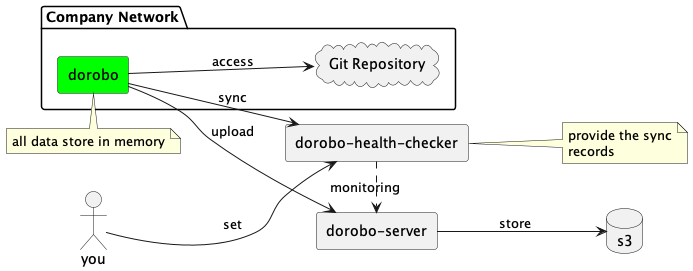

## Dorobo

Dorobo (泥棒) is a command line tool that helps user "backup" all of data from Git repository (github, gitlab, bitbucket...) and sends it to a specified endpoint (support S3) via HTTP or gRPC.

